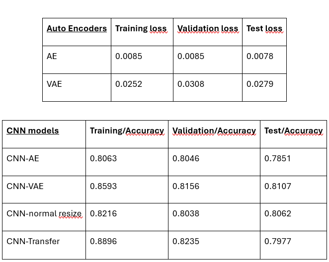

**Projektbeskrivelse og formål**

**Installation og opsætning (fx miljø, dependencies)**
Tjek blandt andet requirements.txt

**Instruktioner til hvordan man kører koden eller notebooks**

**Forklaring af datasæt og kilde**

Dette projekt anvender datasættet **[PatchCamelyon]** fra Kaggle.

Datasættet kan findes her: [Metastatic Tissue Classification - PatchCamelyon](https://www.kaggle.com/datasets/andrewmvd/metastatic-tissue-classification-patchcamelyon)

Bemærk: Du skal have en Kaggle-konto for at kunne downloade datasættet.

PCAM-datasættet består af 327.680 farvebilleder (96x96 pixels), der er udtrukket fra histopatologiske scanninger af lymfeknudesectioner. Hvert billede er annoteret med en binær label, der angiver tilstedeværelsen af metastatisk væv.

Datasættet er specifikt opdelt i 262.144 træningsbilleder, 32.768 valideringsbilleder og 32.768 testbilleder. Du skal bruge trænings- og valideringsbillederne til at træne og validere modeller, der kan klassificere testbillederne præcist.

Vigtigt: Du behøver ikke bruge hele datasættet. Bare brug den mængde data, der er realistisk i forhold til din hardwarekonfiguration.

**Resultater og konklusioner**

**Eventuelle referencer eller links**